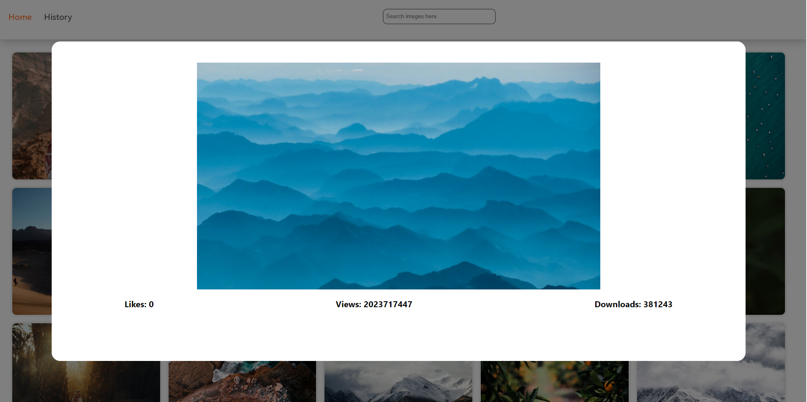

# Making Science | Sweeft Acceleration Program / React.js II Step task

This is a solution to the React.js II Step task

## Table of contents

- [Frontend Mentor - Clock app solution](#frontend-mentor---clock-app-solution)
  - [Table of contents](#table-of-contents)
  - [Overview](#overview)
    - [The challenge](#the-challenge)
    - [Screenshot](#screenshot)
    - [Links](#links)
  - [My process](#my-process)
    - [Built with](#built-with)
  - [Author](#author)

## Overview

### The challenge:

დაწერეთ ფოტო გალერეის აპლიკაცია, რომელსაც ექნება შემდეგი ფუნქციონალი:
1. აპლიკაციას უნდა ჰქონდეს 2 გვერდი: „მთავარი“ და „ისტორია“
2. მთავარ გვერდზე აჩვენეთ 20 ყველაზე პოპულარული სურათი
3. მთავარ გვერდზე დაამატეთ ტექსტური ველი სახელად „ძებნა“, ტექსტში
ინფორმაციის ჩაწერის დროს განაახლეთ სურათები შესაბამისი საძიებო სიტყვის
მიხედვით. (ძებნა ღილაკი არ არის საჭირო)
4. გამოიყენეთ ქეშირების მექანიზმი. მაგალითად, თუ ერთხელ მოვძებნე home, შემდეგ
car, ხოლო შემდეგ ისევ home, მონაცემები აჩვენეთ ქეშიდან და ზედმეტი API
მოთხოვნები არ გააკეთოთ.
5. ისტორიის გვერდზე უნდა ვხედავდე ყველა საძიებო სიტყვას, რომლითაც სურათები
მოვძებნე. თითოეულზე დაჭერისას უნდა მიჩვენოს შესაბამისი სურათები.
6. სურათების ჩვენებისას გამოიყენეთ infinite scroll როგორც მთავარ, ასევე ისტორიის
გვერდზეც
7. სურათზე დაჭერისას სურათის სრულ ვერსიასთან ერთად აჩვენეთ მისი გადმოწერის,
ნახვების და მოწონებების რაოდენობები მოდალურ ფანჯარაში.
8. გამოიყენეთ შემდეგი API: https://unsplash.com/documentation
#### შენიშვნა:
- არ გამოიყენოთ მზა კომპონენტების ბიბლიოთეკები, როგორიცაა mui, antd, bootstrap და ა.შ.
- infinite scroll -ის ფუნქციონალი დაწერეთ დამოუკიდებლად.
- გამოიყენეთ typescript

### Screenshot

### Link

- Solution URL: [https://github.com/GioKhabu/Photo-App.git](https://github.com/GioKhabu/Photo-App.git)

## My process

### Built with

- Semantic HTML5 markup
- CSS modules
- Flexbox
- Grid
- Desctop-first workflow
- SWR React hook
- [React](https://reactjs.org/) - JS library

## Author

- GitHub - [GioKhabu](https://github.com/GioKhabu)
- Frontend Mentor - [@GioKhabu](https://www.frontendmentor.io/profile/GioKhabu)
- Linkedin - [@Giorgi Khaburzania](https://www.linkedin.com/in/giorgi-khaburzania-92010272/)